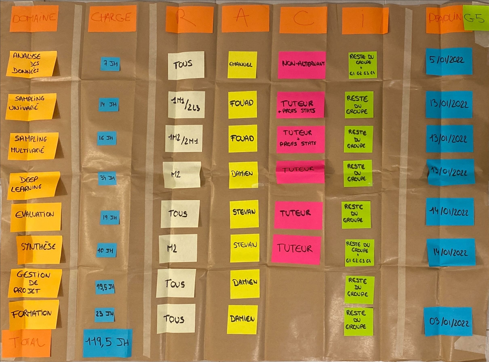

# Travail préparatoire 
Dans ce dossier vous trouverez différentes lectures et documentations qui vous permettront de mieux comprendre les méthodes et outils que nous utiliserons durant notre projet dans le fichier **lecture.md**. 

Vous trouverez aussi 3 notebooks : 
* **exploratory_data_analysis.ipynb :** Exemple simple d'analyse d'un jeu de donnée afin de résumer ses principales caractéristiques à l'aide de visualisations. 
*   **preprocessing_and_classification.ipynb :**  Dans ce notebook je vous présente quelques outils basique de prétraitement des données, suivi d'un exemple simple de création d'un modèle de classification supervisé. 
* **generate_data.ipynb :** Ici je vous propose un exemple de génération de données ( univarié, multivarié ) à l'aide de différentes librairies python. 

Dans chacun d'eux vous avez la possibilité d'ajouter du code,  d'améliorer les résultats obtenus afin de prendre en main les outils que nous allons utiliser durant le projet. 

En fonction de vos compétences vous n'avez pas nécessairement besoin de passer du temps sur chacun d'eux. 

# Création de l'environnement de travail 

Afin de pouvoir exécuter tous les codes du travail préparatoire, je vous conseille de créer un environnement virtuel à partir du fichier **environment.yml** que vous trouverez dans le dossier. 

Vous avez juste à exécuter la commande suivante dans le dossier où se trouve le fichier :

`conda env create -f environment.yml`

L'environnement *PIP_2022* sera ainsi créé avec les librairies nécessaires et vous avez juste à sélectionner le bon environnement avant de lancer vos notebooks.

Si vous rencontrez des soucis n'hésitez pas à me contacter, je suis conscient que tout le monde n'est pas à l'aise avec ces méthodes (git/environnement conda), mais cela nous fera gagner du temps si nous disposons tous du même environnement. 

#  Brown papers

## Brown paper 1

    

    

## Brown paper 2 

    

 
 
